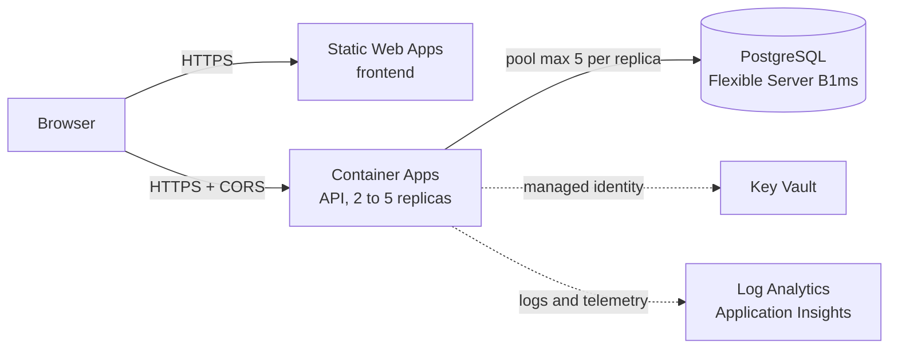
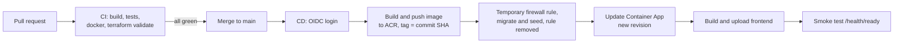

# Architecture

## Request flow

1. The browser loads the static frontend from Static Web Apps.
2. The frontend calls the API directly. CORS only allows the frontend's origin, and plain HTTP is redirected to HTTPS.
3. The API reads case files and comments from PostgreSQL through Prisma.
4. `DATABASE_URL` and the Application Insights connection string come from Key Vault. The Container App reads them with its user-assigned identity `id-wanted-app`.
5. pino writes JSON logs to Log Analytics, and OpenTelemetry sends requests and database calls to Application Insights.

## Deploy flow

The pipeline uses a separate identity, `id-wanted-deploy`, with a federated credential for the `main` branch. It has AcrPush on the registry, Key Vault Secrets User on the vault and Contributor on the resource group. GitHub only stores three IDs as repository variables, no secrets.

A new revision only receives traffic after its readiness probe passes, so a broken image does not replace a working one.

## Why Container Apps

- It runs a normal Docker image, the same one I run locally with Docker Compose.
- Scaling on HTTP load, rolling revisions, probes and HTTPS ingress are built in. With AKS I would have to set up and pay for the cluster, ingress and autoscaler myself, which is too much for one API.
- Compared to App Service, the scale rule works per concurrent request and fits the container workflow better.
- Logs go straight to Log Analytics.

The frontend is fully static, so Static Web Apps on the free tier is enough. PostgreSQL Flexible Server is managed, so backups and patching are handled by Azure.

## Scaling and availability

- At least 2 replicas, so one replica can restart or be replaced without downtime.
- HTTP scale rule at 50 concurrent requests per replica, up to 5 replicas, with a 300 second cooldown before scaling back down.
- The API is stateless. The only shared state is the database.
- Each replica has 0.5 vCPU and 1 GiB memory. Liveness checks `/health`, readiness checks `/health/ready`, both with a 3 second timeout.

## Load test (k6)

Same scenario for both runs: 200 virtual users for 4 minutes, `GET /api/case-files` with no pause (`scripts/loadtest.js`).

| | Run 1 (before) | Run 2 (after) |
| --- | --- | --- |
| Requests | 110,097 | 281,340 |
| Throughput | about 459/s | about 1,172/s |
| Failed requests | 1,342 (5xx, about 1.2%) | 0 |
| p95 duration | above the 1000 ms threshold | 381 ms |
| k6 thresholds | failed | passed |

Run 1 scaled from 2 to 5 replicas as expected, but more replicas made it worse. The logs showed 690 `Too many database connections` errors and 649 connection timeouts. B1ms allows about 40 connections for the app, while 5 replicas with the default pool of 10 can open 50. CPU was at 95 to 97% of 0.25 vCPU, so probes with a 1 second timeout started failing and two replicas were taken out of traffic for a while.

Changes before Run 2:

- Pool limit of 5 connections per replica (5 x 5 = 25) and a 5 second connection timeout.
- 0.5 vCPU and 1 GiB per replica.
- Probe timeout raised from 1 to 3 seconds.

Run 2 handled 2.5 times the throughput with no errors.

## Monitoring

- Console logs in `ContainerAppConsoleLogs_CL`, platform events (scaling, probes, restarts) in `ContainerAppSystemLogs_CL`.
- Application Insights for requests and database calls.
- Email alerts: more than 5 server errors in 5 minutes, and fewer than 2 replicas.
- A monthly budget alert in Cost Management.
